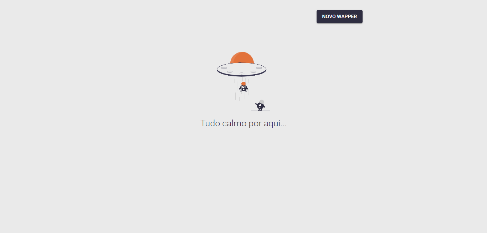
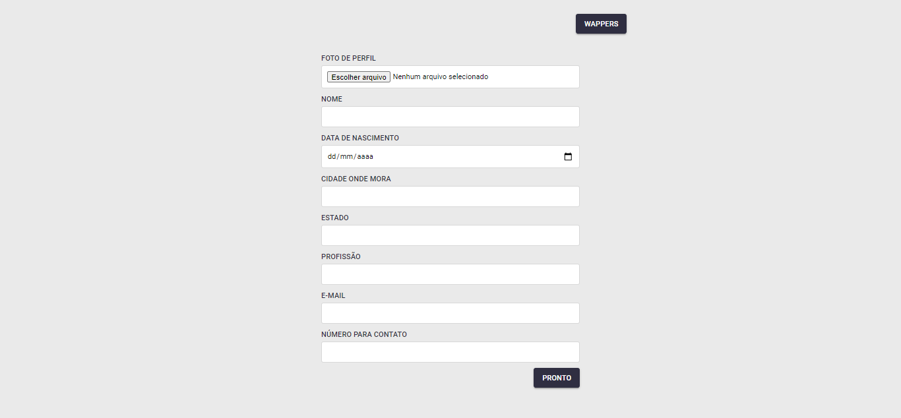
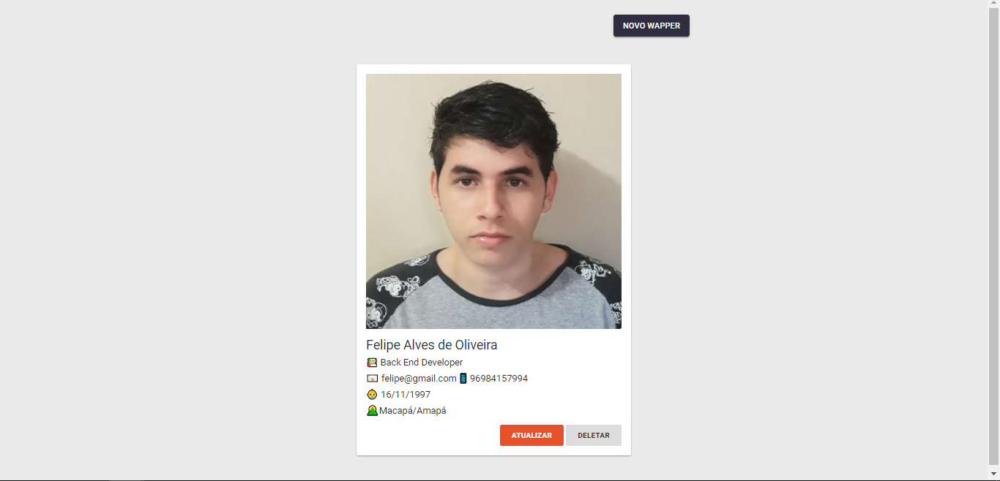

# Onboarding web.art group

- [X] autoload de classe
- [X] MVC
- [X] Orientação a Objetos
- [X] Super classe de Modelo
- [X] Cadastro
- [X] Leitura
- [X] Edição
- [X] Remoção
- [X] Upload de imagens
- [X] Alertas em JS para as ações de sucesso e erro
- [X] CSS básico para organizar o front

# Subindo esse projeto na sua máquina

Clone este repositório para a raiz do seu servidor local.
IMPORTANTE: caso esteja usando Linux, dar permissão 777 na pasta
```
git clone git@github.com:felipeoli7eira/web-art-onboarding.git
```

Renomeie o arquivo ```conf-example.php``` para ```conf.php``` (esse arquivo está em ```source/boot/```). Isto é necessário pois o arquivo de autoload localizado em ```source/``` requer um arquivo com esse nome (```conf.php```)

Em seguida, é preciso setar as configurações de banco de dados, para isso basta informar os parâmetros necessários no ```source/boot/conf.php```

```
/** DATABASE */
define('CONF_DB_HOST', 'localhost');
define('CONF_DB_NAME', 'onboarding');
define('CONF_DB_USER', 'root');
define('CONF_DB_PASSWORD', '');
```

# Comandos para criar o banco e a tabela

```
CREATE DATABASE onboarding DEFAULT CHARACTER SET utf8 DEFAULT COLLATE utf8_general_ci;
```

```
USE onboarding;
```

```
CREATE TABLE wappers (
	id INT NOT NULL AUTO_INCREMENT PRIMARY KEY,
	photo VARCHAR(255),
	name VARCHAR(255) NOT NULL,
	birth DATE NOT NULL,
	city VARCHAR(255) NOT NULL,
	state VARCHAR(255) NOT NULL,
	profession VARCHAR(255) NOT NULL,
	email VARCHAR(255) NOT NULL,
	phone VARCHAR(255),
	created_at TIMESTAMP DEFAULT CURRENT_TIMESTAMP,
	updated_at TIMESTAMP DEFAULT NULL ON UPDATE CURRENT_TIMESTAMP
) DEFAULT CHARSET UTF8;
```

Tudo deverá funcionar corretamente... (assim espero)

# Preview

Home Page (sem dados para listar)


Formulário de cadastro e edição de wapper


Home Page (com dados para listar)
